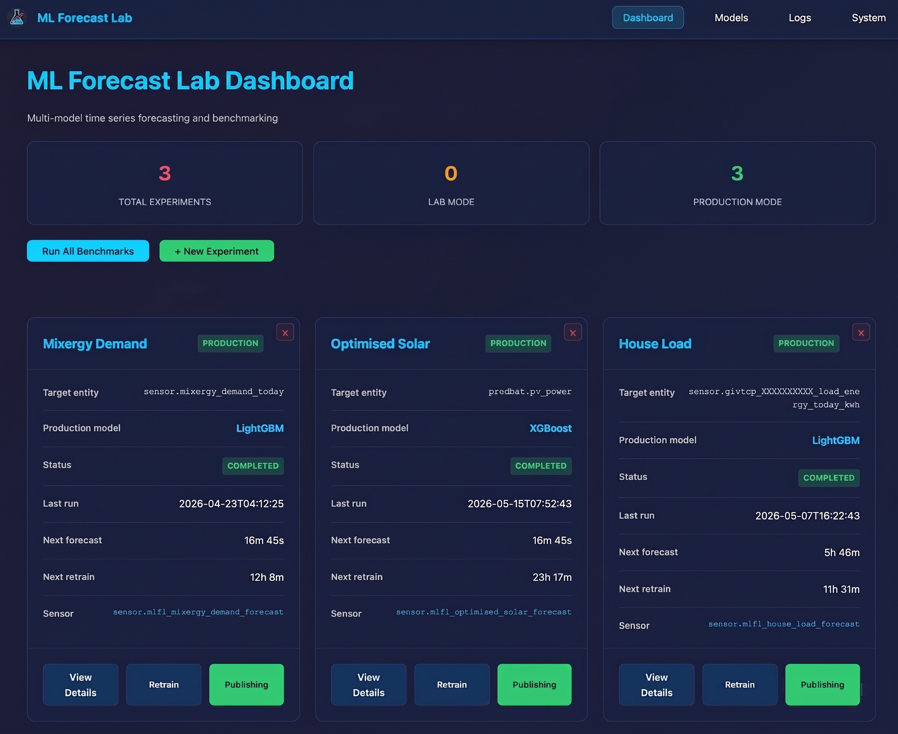

<div align="center">


# ML Forecast Lab

**Multi-model machine learning forecasting for Home Assistant.**

Train, benchmark, and deploy time-series models for any HA sensor — with academic-standard evaluation built in.

[![Latest release][release-shield]][release-link]
[![Licence][licence-shield]][licence-link]
[![Tests][tests-shield]][tests-link]
[![Home Assistant app][ha-shield]][ha-link]
[![Architectures][arch-shield]][release-link]

<a href="https://www.buymeacoffee.com/psweens"></a>

</div>

---

## What this repository is

A Home Assistant app for HA power users who want to forecast a sensor — not data scientists who want a fresh framework. Plug in any sensor, the app benchmarks 24 model backends on your data, picks the winner, retrains it on schedule, and publishes forecasts back to HA with calibrated 80% bands. Designed for the Pi 5 sweet spot: 8 GB RAM, no GPU, ARM64.

The intended mindset is **benchmark once, run forever**. After the first benchmark you click Promote, and the app takes care of retraining + publishing — re-benchmark only when your sensor's behaviour drifts or you want to try newer architectures.

If you're browsing on GitHub, the install button below is the fastest path. The per-app [README](ml-forecast-lab/README.md) and [DOCS](ml-forecast-lab/DOCS.md) render on HA's **Info** and **Documentation** tabs once installed.



## Why this exists

Modern time-series forecasting research rarely reaches the people who'd benefit from it day-to-day. If you're not a data scientist, predicting your home's energy use typically means weeks of glue code, a cloud bill, and a stack of papers.

ML Forecast Lab is here to close that gap: the same models researchers use, packaged so any Home Assistant user can just click through. No PhD, no cloud, no GPU and most importantly, **no fee**.

## Install

[![Open your Home Assistant instance and show the add app repository dialog with this repository pre-filled.][openhainstall-shield]][openhainstall-link]

Or add the repository manually: **Settings → Apps → App store → ⋮ → Repositories**, then paste `https://github.com/psweens/ml-forecast-lab`.

First build takes 10–15 minutes on a Raspberry Pi 5. Subsequent updates use the cached image.

**Supported architectures:** `aarch64` (Raspberry Pi 4/5), `amd64` (x86-64 servers), `armv7`.

## What it does

ML Forecast Lab trains every enabled forecasting backend on your sensor's history, ranks them on identical cross-validation folds with a composite mean rank across MAE / RMSE / MASE (the Demšar 2006 averaging step — see [`docs/RANKING_NOTES.md`](docs/RANKING_NOTES.md) for the caveat on what the rank does and does not claim), and shows you which one wins. Each rank ships with a 95% bootstrap CI over fold resamples so genuine ties are flagged rather than papered over with a single-winner badge. You promote the winner to **production**, and the app retrains it on schedule and publishes forecasts back to Home Assistant as companion sensors with calibrated 80% conformal prediction bands (split conformal with a rolling residual buffer; not adaptive — see [`DOCS.md`](ml-forecast-lab/DOCS.md#how-the-conformal-bands-are-calibrated) for the calibration semantics across retrains).

24 backends are wired in: tree (LightGBM, XGBoost, CatBoost), recurrent (LSTM, GRU), convolutional (CNN, TimesNet), linear / MLP (DLinear, NLinear, TSMixer, TimeMixer, TiDE, SparseTSF), N-BEATS family (N-BEATS, N-HiTS), transformers (PatchTST, iTransformer, Crossformer, TFT), classical (AutoARIMA, AutoETS, AutoTheta), frequency-domain (FITS), and a Seasonal Naive baseline. See [`docs/MODEL_GUIDE.md`](docs/MODEL_GUIDE.md) for picking the right ones.

<details>
<summary><b>Architecture</b></summary>

```
                     mlfl.yaml
                         │
                         ▼
         ┌──────────────┐    ┌──────────────────┐
         │ HA Interface │───▶│ History Database │
         │ (API client) │    │     (SQLite)     │
         └──────────────┘    └────────┬─────────┘
                                      │
                                      ▼
                            ┌──────────────────┐
                            │ Feature Engineer │
                            │ lags + temporal +│
                            │   covariates     │
                            └────────┬─────────┘
                                     │
                ┌────────────────────┼─────────────────────┐
                ▼                    ▼                     │
       ┌─────────────────┐   ┌─────────────────┐           │
       │ Cross-Validator │   │ Model Registry  │           │
       │ walk-fwd or SW  │   │ 24 backends     │           │
       └────────┬────────┘   │ tree+neural+cls │           │
                │            └─────────────────┘           │
                ▼                                          │
      ┌──────────────────┐         ┌──────────────────┐
      │   Benchmarker    │────────▶│   Model Cache    │
      │ Composite rank   │         │ (per experiment) │
      └────────┬─────────┘         └────────┬─────────┘
               │                            │
               ▼                            ▼
      ┌──────────────────┐         ┌──────────────────┐
      │      Web UI      │         │ Forecast Cycle   │
      │   (HA ingress)   │         │ (every 30 min)   │
      └──────────────────┘         └────────┬─────────┘
                                            ▼
                                   ┌──────────────────┐
                                   │   HA Sensor      │
                                   │   Publisher      │
                                   └──────────────────┘
```

Retrain (default 24 h) trains all enabled models from scratch and refreshes the cache. Forecast (default 30 min) uses the cached model for fast inference without retraining.

</details>

## Documentation

| Where it lives | What it covers |
|---|---|
| [`ml-forecast-lab/README.md`](ml-forecast-lab/README.md) | HA store **Info** tab — what the app is, hardware requirements, install, minimal `mlfl.yaml`, first forecast. |
| [`ml-forecast-lab/DOCS.md`](ml-forecast-lab/DOCS.md) | HA store **Documentation** tab — full configuration reference, published sensors, web-UI tour, operations, troubleshooting. |
| [`ml-forecast-lab/CHANGELOG.md`](ml-forecast-lab/CHANGELOG.md) | HA store **Changelog** tab — per-version release notes. |
| [`docs/MODEL_GUIDE.md`](docs/MODEL_GUIDE.md) | Practical "which of the 24 backends should I enable?" with starter sets keyed to data volume, target shape, and Pi compute budget. |

## Development

Tests run locally without an HA instance:

```bash
cd ml-forecast-lab
pip install -r requirements.txt -r tests/requirements-dev.txt
pytest tests/                # 185 tests, ~10s
pytest tests/smoke/          # 61 smoke tests, ~2s — release gate
pytest tests/unit/           # 124 unit tests
```

Both suites are wired into GitHub Actions on every PR and main push (`tests.yml`). The smoke suite boots the FastAPI app against a tmp `mlfl.yaml` and walks the eight golden user flows without needing trained models — designed as a fast release gate that catches UI/API regressions before they ship.

## Contributing

This is a side project with one maintainer, so contribution paths are narrower than a multi-person codebase. Within that, real help is welcome.

**Useful to open:**

- **Bug reports.** Include the app version, the relevant slice of `mlfl.yaml`, and the last 50 lines of the app log. The phase tags (`[BENCH]`, `[MODEL]`, `[HA]`, `[PUB]`, …) make triage quick.
- **Documentation gaps.** If something in DOCS / MODEL_GUIDE didn't prepare you for what you hit, that's a first-class issue.
- **Tested model configurations.** Which backend won on what kind of HA sensor, with how much history, on which hardware. The current guidance in `docs/MODEL_GUIDE.md` is grounded in a narrow set of household sensors; broader data sharpens it.
- **Better defaults for the 24 backends on Pi-scale data.** The benchmark harness in `ml_forecast_lab/benchmark/` is already built; results that beat the current defaults are welcome as PRs to `model_overrides`.

**Discuss scope before opening a PR:**

- Refactors to core orchestration (`ml_forecast_lab/main.py`) — a single large file driving both lab and production cycles. Changes here need agreement on shape first.
- New backends — the registry is open, but each backend is meaningful review effort. Open an issue with a paper reference and a small comparison first.

**Not a contribution path today:**

- UI translations. The web UI is hard-coded English and there is no merge surface for translated strings.

For security issues, follow [`SECURITY.md`](SECURITY.md) — private disclosure via GitHub's vulnerability reporting.

## Status

Stable codebase, first public release. The project was developed in a private repository through 175 internal versions before opening; behaviour and interfaces are settled, but the public user base is small and feedback-driven. Maintained on a best-effort basis as a side project — issues are triaged, cadence is set by available evenings.

## Acknowledgements

The 24 model backends are implementations of published architectures by their respective authors; `docs/MODEL_GUIDE.md` lists each one by paper. Standing on the shoulders of:

- [Nixtla `statsforecast`](https://github.com/Nixtla/statsforecast) for the classical baselines (AutoARIMA / AutoETS / AutoTheta).
- [LightGBM](https://github.com/microsoft/LightGBM), [XGBoost](https://github.com/dmlc/xgboost), and [CatBoost](https://github.com/catboost/catboost) for the tree backends.
- [PyTorch](https://pytorch.org/) for the neural backends.
- [Optuna](https://optuna.org/) for Bayesian hyperparameter tuning.
- [pvlib](https://pvlib-python.readthedocs.io/) for the Ineichen clear-sky-irradiance feature.
- [FastAPI](https://fastapi.tiangolo.com/), [Jinja2](https://palletsprojects.com/p/jinja/), [HTMX](https://htmx.org/), and [Plotly](https://plotly.com/javascript/) for the web UI.
- Demšar (2006), *Statistical Comparisons of Classifiers over Multiple Data Sets* — the per-fold rank-averaging step used by the composite mean rank. The full Friedman / Nemenyi procedure described in the paper isn't applied here (it assumes independent datasets, not CV folds of one series); see [`docs/RANKING_NOTES.md`](docs/RANKING_NOTES.md) for what the rank does and does not claim.
- The [`home-assistant/hassio-addons`](https://github.com/hassio-addons) Ubuntu base image and the Home Assistant app platform itself.

## Support development

ML Forecast Lab is free and open-source, and stays that way. If it's saved you time or sharpened your automations, a coffee helps me keep maintaining it, fixing bugs, and adding more model backends.

<a href="https://www.buymeacoffee.com/psweens"></a>

## Licence

[MIT](LICENSE) © Dr Paul W. Sweeney, University of Cambridge.

<!-- Badges -->
[release-shield]: https://img.shields.io/github/v/release/psweens/ml-forecast-lab?style=flat-square&color=41bdf5
[release-link]: https://github.com/psweens/ml-forecast-lab/releases/latest
[licence-shield]: https://img.shields.io/github/license/psweens/ml-forecast-lab?style=flat-square&color=41bdf5
[licence-link]: LICENSE
[tests-shield]: https://img.shields.io/github/actions/workflow/status/psweens/ml-forecast-lab/tests.yml?branch=main&style=flat-square&label=tests&color=41bdf5
[tests-link]: https://github.com/psweens/ml-forecast-lab/actions/workflows/tests.yml
[ha-shield]: https://img.shields.io/badge/Home%20Assistant-app-41bdf5?style=flat-square&logo=home-assistant&logoColor=white
[ha-link]: https://www.home-assistant.io/
[arch-shield]: https://img.shields.io/badge/arch-aarch64%20%7C%20amd64%20%7C%20armv7-41bdf5?style=flat-square
[openhainstall-shield]: https://my.home-assistant.io/badges/supervisor_add_addon_repository.svg
[openhainstall-link]: https://my.home-assistant.io/redirect/supervisor_add_addon_repository/?repository_url=https%3A%2F%2Fgithub.com%2Fpsweens%2Fml-forecast-lab
